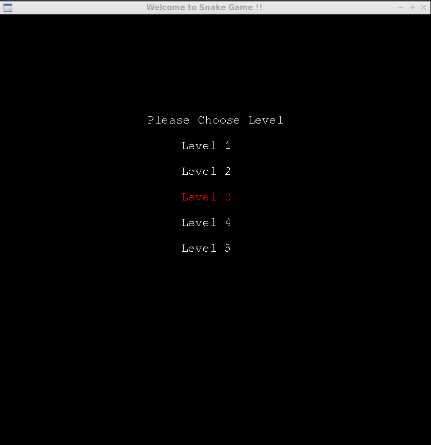
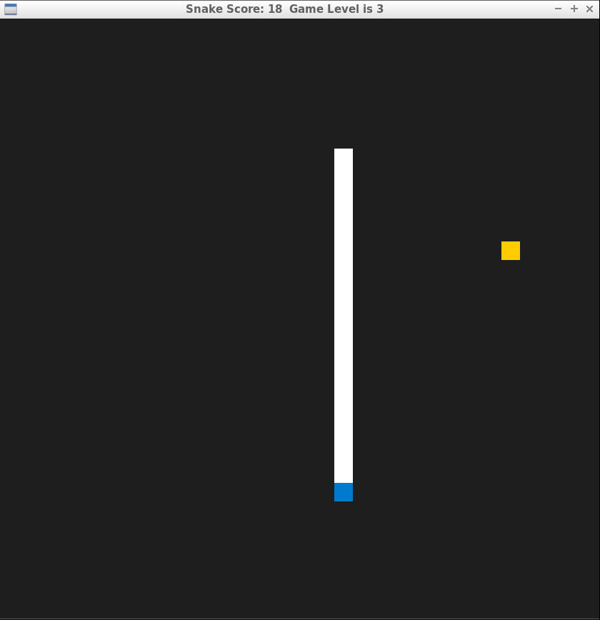
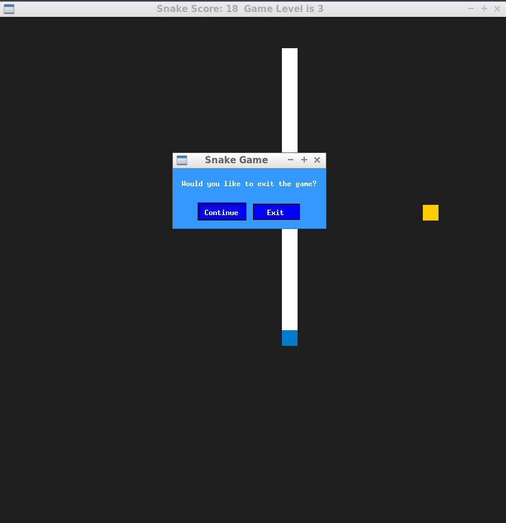

# CPPND: Capstone Snake Game

I extended the Snake Game starter repo for the Capstone project in the [Udacity C++ Nanodegree Program](https://www.udacity.com/course/c-plus-plus-nanodegree--nd213) to make more complete Game. I included SDL2_TTF to rander the text on the screen to give more animated game experience to game player and when the game player want to exit the game with escape key, pop up window will help to guide the end of game. I also modified the snake size and speed as the game progress to give more exciting experience to game player. 

I had the chance to integrate what you've learned throughout Udacity cpp program.
Loops, Function, I/O
* A variety of control structures are used in the project. The project code is clearly organized into functions.
  * I understood given basic code structure and I exteded further by inserting various function
    * extended function - controller.h : line 16 - int Render(); 
    * extended function - game.h : line 16 - int GetSize() const; line 33 - void setLevelFoodCount(int &food_count); 
    * extended function - renderer.h : line 16 int Render();
* The project accepts input from a user as part of the necessary operation of the program.
  * User can chose the level - renderer.cpp line : 98 while(SDL_PollEvent(&event)) from mouse event
  * User can escape with esc key with pop up menu -- controller.cpp line 38 : case SDLK_ESCAPE: from keyboard event
OOP
* All class data members are explicitly specified as public, protected, or private.
  * each class follow public and private variable and method.
  	* controller.h, game.h, renderer.h, snamek.h - all 
* One function is overloaded with different signatures for the same function name.
  * renderer.h : line 16 int Render();
  * renderer.h : line 17 void Render(Snake const snake, SDL_Point const &food);
* At least two variables are defined as references, or two functions use pass-by-reference in the project code.
  * void Render(Snake const snake, SDL_Point const &food);
  * void Run(Controller const &controller, Renderer &renderer, std::size_t target_frame_duration);

## Dependencies for Running Locally
* cmake >= 3.7
  * All OSes: [click here for installation instructions](https://cmake.org/install/)
* make >= 4.1 (Linux, Mac), 3.81 (Windows)
  * Linux: make is installed by default on most Linux distros
  * Mac: [install Xcode command line tools to get make](https://developer.apple.com/xcode/features/)
  * Windows: [Click here for installation instructions](http://gnuwin32.sourceforge.net/packages/make.htm)
* SDL2 >= 2.0
  * All installation instructions can be found [here](https://wiki.libsdl.org/Installation)
  >Note that for Linux, an `apt` or `apt-get` installation is preferred to building from source. 
    * sudo apt install libsdl2-dev
    * sudo apt-get install libsdl2-dev
* SDL2 TTF >= 2.0
  * All installation instructions can be found here
  * Note that for Linux, an apt or apt-get installation is preferred to building from source.
    * sudo apt install libsdl2-ttf-dev
    * sudo apt-get install libsdl2-ttf-dev
* gcc/g++ >= 5.4
  * Linux: gcc / g++ is installed by default on most Linux distros
  * Mac: same deal as make - [install Xcode command line tools](https://developer.apple.com/xcode/features/)
  * Windows: recommend using [MinGW](http://www.mingw.org/)

## Basic Build Instructions

1. Clone this repo.
2. Make a build directory in the top level directory: `mkdir build && cd build`
3. Compile: `cmake .. && make`
4. Run it: `./SnakeGame`.

## CC Attribution-ShareAlike 4.0 International

Shield: [![CC BY-SA 4.0][cc-by-sa-shield]][cc-by-sa]

This work is licensed under a
[Creative Commons Attribution-ShareAlike 4.0 International License][cc-by-sa].

[![CC BY-SA 4.0][cc-by-sa-image]][cc-by-sa]

[cc-by-sa]: http://creativecommons.org/licenses/by-sa/4.0/
[cc-by-sa-image]: https://licensebuttons.net/l/by-sa/4.0/88x31.png
[cc-by-sa-shield]: https://img.shields.io/badge/License-CC%20BY--SA%204.0-lightgrey.svg
